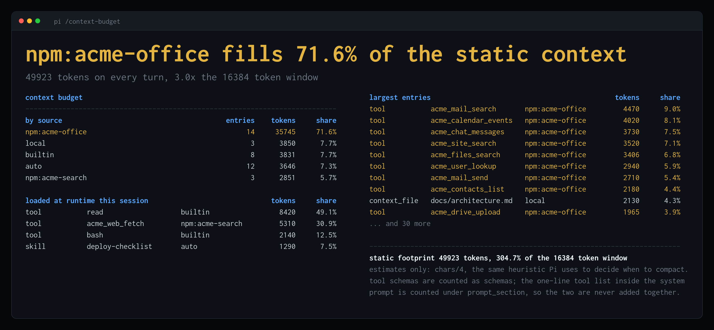

# pi-prometheus



Shows which extension, skill, MCP server or context file is eating your context window,
and exposes every session number on a Prometheus `/metrics` endpoint.

## Install

```bash
pi install npm:pi-prometheus
```

## Works without Prometheus

No scraper, no config, no daemon. Two commands inside the session.

### `/context-budget`

What a session pays on **every** request, before you type a word, attributed to the
thing that caused it:

```
context budget
----------------------------------------------------------------------------
by source                                        entries    tokens     share
npm:acme-office                                       14     35745     71.6%
local                                                  3      3850      7.7%
builtin                                                8      3831      7.7%
auto                                                  12      3646      7.3%
npm:acme-search                                        3      2851      5.7%

largest entries                                             tokens     share
tool           acme_mail_search       npm:acme-office         4470      9.0%
tool           acme_calendar_events   npm:acme-office         4020      8.1%
tool           acme_chat_messages     npm:acme-office         3730      7.5%
tool           acme_site_search       npm:acme-office         3520      7.1%
tool           acme_files_search      npm:acme-office         3406      6.8%
tool           acme_user_lookup       npm:acme-office         2940      5.9%
tool           acme_mail_send         npm:acme-office         2710      5.4%
tool           acme_contacts_list     npm:acme-office         2180      4.4%
context_file   docs/architecture.md   local                   2130      4.3%
tool           acme_drive_upload      npm:acme-office         1965      3.9%
... and 30 more

loaded at runtime this session                              tokens     share
tool           read                   builtin                 8420     49.1%
tool           acme_web_fetch         npm:acme-search         5310     30.9%
tool           bash                   builtin                 2140     12.5%
skill          deploy-checklist       auto                    1290      7.5%

----------------------------------------------------------------------------
static footprint 49923 tokens, 304.7% of the 16384 token window
estimates only: chars/4, the same heuristic Pi uses to decide when to compact.
tool schemas are counted as schemas; the one-line tool list inside the system
prompt is counted under prompt_section, so the two are never added together.
```

`kind` is a closed set of four: `tool` (a tool's JSON schema), `skill` (its entry in the
skills block), `context_file` (a file Pi injects, `AGENTS.md` and friends), and
`prompt_section` (Pi's own instructions, the one-line tool list included).

`source` is where the thing came from. `builtin` is Pi itself, `npm:<package>`,
`git:<repo>` and `local` are the three ways a package can be installed, and `auto` is
anything Pi discovered by convention rather than through a package: a skill sitting in
`~/.pi/agent/skills` or in a project's `.pi/skills` (`dist/core/package-manager.js:1941`).

**`auto` is a real limit, not a category.** A skill dropped into one of those directories
by hand carries no package identity anywhere in Pi, so this exporter has none to report.
On a machine where most skills arrived that way the by-source table collapses into a
single large `auto` bucket. Measured on a real session: `auto` was 97 percent of a 49923
token static footprint, 48506 tokens of skills against 1417 of builtin, with a 16384
token window. Three times the window, before a word was typed. The
largest-entries table still names every skill and its cost individually, so the
information is not lost, it moves out of the by-source view.

The second table is what the session read in afterwards: tool results, and reads that
landed inside a skill's directory, which is the half of a skill that progressive
disclosure keeps out of the system prompt.

### `/metrics`

The session's own numbers, and where to scrape them:

```
pi-prometheus
----------------------------------------------------------------------------
endpoint                http://127.0.0.1:54321/metrics
targets dir             /Users/you/.pi/metrics/targets
session                 01K3Q7M2X4E8VBN0T5RHJC9WYD
model                   anthropic/claude-sonnet-4-6

input tokens                   18422
output tokens                   3117
cache read tokens             210488
cache write tokens             49923
cost usd                      0.7413
turns                             14
static footprint               49923
attribution             full, top 100
```

The endpoint is live from session start, so `curl` works with no Prometheus anywhere.

### Status line

`PI_PROMETHEUS_STATUS` controls the entry in Pi's status line:

| Value | Shows |
|---|---|
| `off` | nothing |
| `port` (default) | `metrics :54321` |
| `full` | `ctx 62% $0.74 :54321` |

Refreshed on message end and on compaction, never on the token stream.

## Add Prometheus

Every session binds `/metrics` on an ephemeral loopback port and writes a target file to
`~/.pi/metrics/targets/<pid>.json`. Point a scraper at that directory once and every
session, 1 or 10 in parallel, is discovered and dropped automatically.

```yaml
scrape_configs:
  - job_name: pi
    scrape_interval: 15s
    file_sd_configs:
      - files: ["/Users/<you>/.pi/metrics/targets/*.json"]
        refresh_interval: 15s
```

Full example: [`examples/prometheus-scrape.yml`](examples/prometheus-scrape.yml).
VictoriaMetrics takes the same file via `-promscrape.config`
([`examples/victoriametrics-scrape.yml`](examples/victoriametrics-scrape.yml)).
Grafana Mimir and anything else that scrapes the Prometheus text format work too.

`session_id`, `cwd` and `pid` arrive as target labels from service discovery, so every
series is attributable to its session without the exporter emitting those labels itself.

### The whole stack in one command

```bash
# edit the pi-targets bind mount first: Compose does not expand ~
docker compose -f examples/docker-compose.yml up -d
pi
```

Prometheus on `127.0.0.1:9090`, Grafana on `127.0.0.1:3000`, both dashboards provisioned
in a folder named Pi, filled within a minute. See
[`examples/docker-compose.yml`](examples/docker-compose.yml) for the Linux note.

### Dashboards

- [`examples/grafana-dashboard.json`](examples/grafana-dashboard.json), "Pi coding agent":
  sessions online, cost, context usage, token rate, tool calls and errors, turn duration
  percentiles, filterable per session.
- [`examples/grafana-dashboard-attribution.json`](examples/grafana-dashboard-attribution.json),
  "Pi context attribution": context tax by package, largest entries, tokens before you
  type, static footprint over time, runtime ingestion by source.

## Metrics

| Metric | Type | Labels | Meaning |
|---|---|---|---|
| `pi_session_info` | gauge | `model`, `cwd`, `session_id` | Static session info (always 1) |
| `pi_prometheus_build_info` | gauge | `version`, `pi_version` | Exporter version and the Pi it runs in (always 1) |
| `pi_session_start_time_seconds` | gauge | | Unix time the session started |
| `pi_tokens_total` | counter | `type` = `input` \| `output` \| `cache_read` \| `cache_write` | Tokens consumed |
| `pi_cost_usd_total` | counter | | Cumulative cost (provider cost model) |
| `pi_turns_total` | counter | | Agent turns completed |
| `pi_tool_calls_total` | counter | `tool` | Tool executions |
| `pi_tool_errors_total` | counter | `tool` | Tool executions that errored |
| `pi_compactions_total` | counter | `reason` | Context compactions |
| `pi_compaction_failures_total` | counter | `reason` | Compactions that failed or were aborted |
| `pi_context_static_tokens` | gauge | | Estimated tokens the system prompt and tool schemas cost on every turn |
| `pi_context_footprint_tokens` | gauge | `kind`, `name`, `source` | The same total, split by what caused it |
| `pi_source_tokens_total` | counter | `kind`, `name`, `source` | Tokens ingested at runtime, by source |
| `pi_tool_nested_tokens_total` | counter | `tool`, `type` | Sub-agent tokens spent inside a tool, when the tool reports usage |
| `pi_tool_nested_cost_usd_total` | counter | `tool` | Cost in USD of that sub-agent work |
| `pi_context_tokens` | gauge | | Estimated tokens currently in context |
| `pi_context_window_tokens` | gauge | | Context window of the active model |
| `pi_turn_duration_seconds` | histogram | `le` | Turn duration (buckets 5s to 600s, sized for local models) |

The two families carrying `kind`, `name` and `source` are the ones
`PI_PROMETHEUS_ATTRIBUTION` gates. `pi_context_static_tokens` is emitted whatever the
attribution and cardinality settings say, and stays the true total.

Useful queries:

```promql
# which package costs the most, per session
sum by (source) (pi_context_footprint_tokens)

# what a package costs as a share of the window
sum by (instance, source) (pi_context_footprint_tokens)
  / on (instance) group_left pi_context_window_tokens

# what got read in during the session, by package
sum by (source) (rate(pi_source_tokens_total[$__rate_interval]))
```

## How attribution works, and what it does not claim

**The numbers are estimates, and they are Pi's own estimates.** Token counts are
`chars/4`, the same heuristic Pi uses to decide when to compact
(`dist/core/compaction/compaction.js:188`, Pi 0.84.3). No tokenizer is involved, in this package or
in that decision. The consequence is the point: these numbers and Pi's own context gauge
agree by construction, so a footprint of 15 percent here is 15 percent of the same window
Pi is about to compact.

**Tool schemas are over-estimated.** JSON schemas tokenise denser than four characters
per token, so a package that ships large schemas looks slightly more expensive than it
is. The ranking between packages holds; the absolute number is an upper bound.

**Cost per source is not attributable, and is not claimed.** Billed tokens cover the
whole request, conversation history included, so there is no honest way to split a
dollar figure across the sources that filled the prompt. This package reports tokens and
footprints per source, and dollars only for the session as a whole
(`pi_cost_usd_total`) or for sub-agent work a tool reports itself
(`pi_tool_nested_cost_usd_total`).

**A tool is counted twice, under two different kinds, and never summed.** Once as its
full JSON schema, measured against the tool definitions, under `kind="tool"`. Once as its
one-line entry inside the system prompt, measured against the real assembled prompt
string, under `kind="prompt_section"`. The same rule applies to `pi_source_tokens_total`:
a `read` inside a skill's directory is credited to both `kind="tool"` and `kind="skill"`.
Sum by `kind`, never across it.

**Only tools Pi actually sent are counted.** `pi.getAllTools()` returns configured tools,
not active ones, so the footprint intersects it with the active set before attributing.

**Cardinality is capped, and the cap folds rather than drops.** Past
`PI_PROMETHEUS_ATTRIBUTION_TOP_N` named series, the tail collapses into `name="_other"`
rows, one per `kind` and `source`. `sum by (source)` and `sum by (kind)` therefore stay
exact however hard the cap bites. Two more things worth knowing:

- The fold also applies to `pi_source_tokens_total`, which is a counter. When an entry
  climbs into the visible set between two scrapes, the `_other` series it leaves drops,
  and `rate()` reads that decrease as a counter reset. Set
  `PI_PROMETHEUS_ATTRIBUTION_TOP_N` above your entry count, or query
  `sum by (source)`, if that matters to you.
- `before_agent_start` only fires when a prompt is submitted, so a session where nothing
  has been typed has no footprint yet. `/context-budget` computes it on demand in that
  case, which is why the command works on a session that has said nothing.

## Configuration

| Env var | Default | Meaning |
|---|---|---|
| `PI_PROMETHEUS_DIR` | `~/.pi/metrics/targets` | Directory for service-discovery target files |
| `PI_PROMETHEUS_ATTRIBUTION` | `full` | `off` drops the two per-source families and keeps `pi_context_static_tokens`, `rollup` keeps `source` and `kind` and collapses `name`, `full` names everything |
| `PI_PROMETHEUS_ATTRIBUTION_TOP_N` | `100` | Named series kept before the tail folds into `_other`. Zero or less means no cap |
| `PI_PROMETHEUS_STATUS` | `port` | Status line entry: `off`, `port`, `full` |

## Alerting

[`examples/alerts.yml`](examples/alerts.yml) ships four rules, loaded by both the scrape
config and the Compose stack:

| Alert | Fires when |
|---|---|
| `PiContextFootprintHigh` | Static footprint is above 15 percent of the window for 10m |
| `PiSessionNearCompaction` | Context is above 85 percent of the window for 5m |
| `PiToolErrorRateHigh` | A tool fails more than one call in five over 15m, on at least five calls |
| `PiSpendRateHigh` | Spend rate stays above $5 per hour for 10m |

Every ratio divides by a positive-value matcher, so a session that has not reported yet
produces no series instead of `NaN`.

## Notes

- The endpoint binds `127.0.0.1` only. Nothing is exposed on the network.
- Works in all Pi run modes. The reports render as custom entries in the TUI and are
  printed through `notify` in `--print`, JSON and RPC modes, where a custom entry would
  be invisible.
- Counters reset on `session_start`, which covers startup, `/new`, `resume` and `fork`.
  Before 0.2.0 they did not: Pi caches the extension module per working directory, so the
  totals of the previous session carried into the next one in the same directory. If your
  0.1.0 graphs show a session's counters continuing across a `/new`, that is the bug, and
  the discontinuity you see after upgrading is the fix. See
  [`CHANGELOG.md`](CHANGELOG.md).
- A custom entry costs no context tokens, so watching your budget does not add to it.

## Development

```bash
npm test    # node test/check.ts
```

The self-check boots the extension against a fake `ExtensionAPI` and a hand-written
system prompt, fires the events Pi would fire, and asserts on `/metrics` output: counter
reset across sessions, both halves of Pi's module cache included; the target-file
lifecycle, stale and `.tmp` cleanup and the liveness decision table; attribution lines
against token counts computed independently of the code under test; the three
attribution modes and the top-N fold; a read credited to the skill that owns the path;
both commands and the status line; and a `tool_result` carrying no `usage` field.

```bash
npm run poster   # regenerates examples/media/context-budget.png, needs Docker
```

## Positioning

The only pull-based scrape endpoint in the Pi ecosystem. No collector, no OTLP endpoint,
no push gateway to run: all 35 other Pi observability packages push.

## License

MIT
